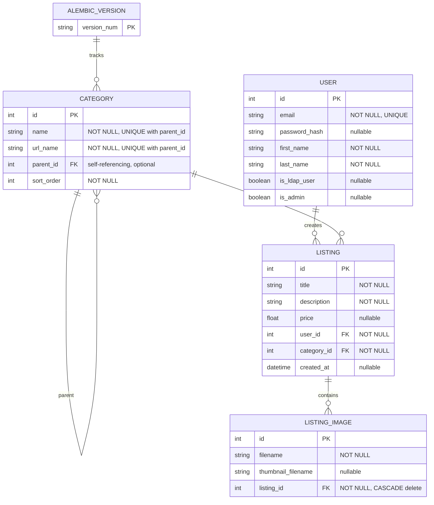

# Database Schema

## ER Diagram

## Schema Details

### alembic_version
Alembic migration tracking table for database versioning.

| Column | Type | Constraints |
|--------|------|-------------|
| `version_num` | VARCHAR(32) | PRIMARY KEY |

---

### category
Hierarchical category system supporting parent-child relationships and URL-friendly naming.

| Column | Type | Constraints |
|--------|------|-------------|
| `id` | INTEGER | PRIMARY KEY, auto-increment |
| `name` | VARCHAR(64) | NOT NULL, UNIQUE(name, parent_id) |
| `url_name` | VARCHAR(128) | NOT NULL, UNIQUE(url_name, parent_id), INDEXED |
| `parent_id` | INTEGER | FOREIGN KEY → category(id), nullable (top-level categories) |
| `sort_order` | INTEGER | NOT NULL (for UI ordering) |

**Indexes:**
- `ix_category_url_name` on `url_name`

**Notes:**
- Self-referencing for hierarchical structure
- Supports unlimited nesting depth
- Both `name` and `url_name` must be unique within their parent context

---

### user
System users with support for local authentication and LDAP integration.

| Column | Type | Constraints |
|--------|------|-------------|
| `id` | INTEGER | PRIMARY KEY, auto-increment |
| `email` | VARCHAR(120) | NOT NULL, UNIQUE |
| `password_hash` | VARCHAR(128) | nullable (for LDAP users) |
| `first_name` | VARCHAR(64) | NOT NULL |
| `last_name` | VARCHAR(64) | NOT NULL |
| `is_ldap_user` | BOOLEAN | nullable |
| `is_admin` | BOOLEAN | nullable |

**Notes:**
- Email is unique identifier
- LDAP users may not have password_hash
- Admin flag controls access to administrative features

---

### listing
Classified listings with ownership and categorization.

| Column | Type | Constraints |
|--------|------|-------------|
| `id` | INTEGER | PRIMARY KEY, auto-increment |
| `title` | VARCHAR(64) | NOT NULL |
| `description` | TEXT | NOT NULL |
| `price` | FLOAT | nullable |
| `user_id` | INTEGER | NOT NULL, FOREIGN KEY → user(id) |
| `category_id` | INTEGER | NOT NULL, FOREIGN KEY → category(id) |
| `created_at` | DATETIME | nullable |

**Notes:**
- Each listing belongs to one user (creator)
- Each listing belongs to one category
- Price is optional (for non-priced items)

---

### listing_image
Images associated with listings, with automatic thumbnail management.

| Column | Type | Constraints |
|--------|------|-------------|
| `id` | INTEGER | PRIMARY KEY, auto-increment |
| `filename` | VARCHAR(256) | NOT NULL |
| `thumbnail_filename` | VARCHAR(256) | nullable |
| `listing_id` | INTEGER | NOT NULL, FOREIGN KEY → listing(id) ON DELETE CASCADE |

**Notes:**
- Multiple images per listing supported
- Automatic thumbnail generation (224x224 JPEG)
- ON DELETE CASCADE ensures cleanup when listing is deleted
- Original and thumbnail filenames stored separately

---

## Relationships

### One-to-Many Relationships

1. **User → Listing**: One user can create many listings
2. **Category → Listing**: One category can contain many listings
3. **Listing → ListingImage**: One listing can have many images

### Self-Referencing Relationship

- **Category → Category**: Categories can have parent categories (hierarchical structure)

### Cascading Deletes

- **Listing deletion** → automatically deletes all associated ListingImages

---

## Key Design Features

- **Hierarchical Categories**: Support for nested category structures (e.g., Electronics → Computers → Laptops)
- **URL-Safe Naming**: `url_name` field enables clean URL generation for category hierarchies
- **Flexible Authentication**: Support for both local (password) and LDAP authentication
- **Image Management**: Separate storage of original and thumbnail filenames
- **Atomic Deletion**: CASCADE delete ensures orphaned images are cleaned up automatically
- **SQLite Compatible**: Uses batch mode for all schema modifications (no ALTER COLUMN operations)

---

## Indexes

| Table | Column | Purpose |
|-------|--------|---------|
| category | url_name | Fast URL-based category lookups |

## Foreign Key Constraints

| Table | Column | References | Behavior |
|-------|--------|-----------|----------|
| category | parent_id | category(id) | No action (allows NULL) |
| listing | user_id | user(id) | Restrict |
| listing | category_id | category(id) | Restrict |
| listing_image | listing_id | listing(id) | CASCADE delete |
